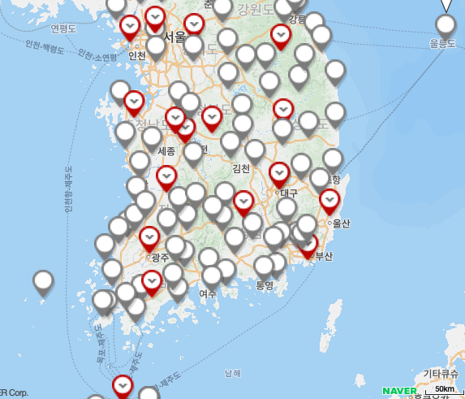
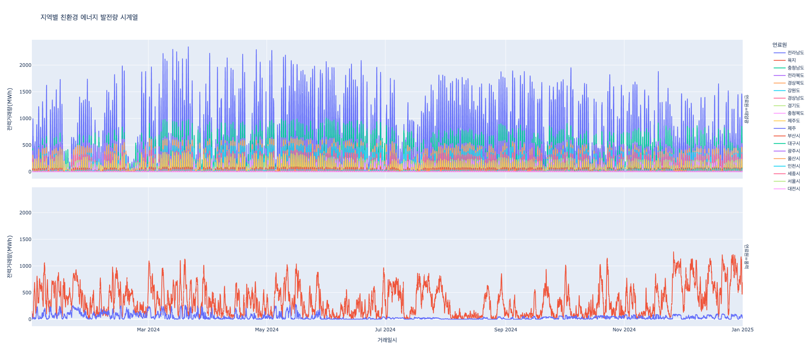

## 데이터분석 프로젝트 - 친환경 에너지 생산량 데이터 분석

## 1. 프로젝트 개요

### 1.1 프로젝트 구조

```bash
.
├── data
│ # └── 분석을 위한 데이터
├── images
│ # └── images for README.md
├── main.ipynb
├── README.md
└── region_energy_timeseries.html # 지역별 친환경 에너지 생산량 인터렉티브 그래프
```

### 1.2 프로젝트 동기 및 목적

기후 변화에 대응하고 탄소중립을 실현하기 위한 전 세계적 노력이 가속화되는 가운데, 재생에너지의 중요성이 날로 증가하고 있습니다. 특히 대한민국은 2050년 탄소중립 목표를 선언하고 재생에너지 비중을 대폭 확대하는 정책을 추진하고 있습니다.

본 프로젝트는 2024년 한국전력거래소의 지역별 태양광 및 풍력 발전량 데이터와 기상관측 데이터를 종합적으로 분석하여, 재생에너지 발전의 효율성을 높이고 안정적인 전력 공급 방안을 모색하고자 합니다. 빅데이터 분석 기법을 활용하여 기상 조건과 재생에너지 발전량 간의 상관관계를 알아내고, 이를 통해 전력 수급 안정화에 기여하고자 합니다.

### 1.3 기대효과

- **전력 수급 안정화**: 정확한 재생에너지 발전량 예측을 통한 효율적인 전력 수급 계획 수립
- **경제적 효과**: 재생에너지 발전 효율 향상을 통한 발전 단가 절감 및 전력 거래 수익성 개선
- **환경적 효과**: 재생에너지 활용도 제고를 통한 온실가스 감축 및 환경 보호
- **정책적 효과**: 데이터 기반의 재생에너지 정책 수립을 위한 객관적 근거 제공

## 2. 활용 데이터

- [한국전력거래소\_지역별 시간별 태양광 및 풍력 발전량](https://www.data.go.kr/data/15065269/fileData.do)
  - 작년 1년간 지역별(서울시, 인천시, 대전시, 경상북도, 전라북도, 울산시, 광주시, 부산시, 충청남도, 제주, 강원도, 충청북도, 세종시, 전라남도, 경상남도) 태양광 전력거래량
  - 작년 1년간 지역별(육지, 제주) 풍력발전 전력거래량
- [종관기상관측 AOSP 파일셋](https://data.kma.go.kr/data/grnd/selectAsosRltmList.do?pgmNo=36&tabNo=1)
  
  - 각 시도별 대표 관측소 선정(서울, 인천, 대전, 안동, 전주, 울산, 광주, 부산, 홍성, 제주, 양평, 정선군, 보은, 세종, 장흥, 합천, 제주, 양평)
    - 데이터 변수
      - 지점(코드),지점명,일시,평균기온(°C),최저기온(°C),최저기온 시각(hhmi),최고기온(°C),최고기온 시각(hhmi),강수 계속시간(hr),10분 최다 강수량(mm),10분 최다강수량 시각(hhmi),1시간 최다강수량(mm),1시간 최다 강수량 시각(hhmi),일강수량(mm),최대 순간 풍속(m/s),최대 순간 풍속 풍향(16방위),최대 순간풍속 시각(hhmi),최대 풍속(m/s),최대 풍속 풍향(16방위),최대 풍속 시각(hhmi),평균 풍속(m/s),풍정합(100m),최다풍향(16방위),평균 이슬점온도(°C),최소 상대습도(%),최소 상대습도 시각(hhmi),평균 상대습도(%),평균 증기압(hPa),평균 현지기압(hPa),최고 해면기압(hPa),최고 해면기압 시각(hhmi),최저 해면기압(hPa),최저 해면기압 시각(hhmi),평균 해면기압(hPa),가조시간(hr),합계 일조시간(hr),1시간 최다일사 시각(hhmi),1시간 최다일사량(MJ/m2),합계 일사량(MJ/m2),일 최심신적설(cm),일 최심신적설 시각(hhmi),일 최심적설(cm),일 최심적설 시각(hhmi),합계 3시간 신적설(cm),평균 전운량(1/10),평균 중하층운량(1/10),평균 지면온도(°C),최저 초상온도(°C),평균 5cm 지중온도(°C),평균 10cm 지중온도(°C),평균 20cm 지중온도(°C),평균 30cm 지중온도(°C),0.5m 지중온도(°C),1.0m 지중온도(°C),1.5m 지중온도(°C),3.0m 지중온도(°C),5.0m 지중온도(°C),합계 대형증발량(mm),합계 소형증발량(mm),9-9강수(mm),기사,안개 계속시간(hr)

## 3. 데이터 전처리

### 3.1 기상 데이터 병합

태양광 데이터의 경우 시·도 기준의 지역명이 기재되어 있어, 기상관측 데이터와의 결합을 위해 다음과 같은 맵핑 테이블을 구성하였습니다.

```python
location_mapping = {
    '서울시': '서울',
    '인천시': '인천',
    '대전시': '대전',
    '경상북도': '안동',
    '전라북도': '전주',
    '울산시': '울산',
    '광주시': '광주',
    '부산시': '부산',
    '충청남도': '홍성',
    '제주도': '제주',
    '경기도': '양평',
    '강원도': '정선군',
    '충청북도': '보은',
    '세종시': '세종',
    '전라남도': '장흥',
    '경상남도': '합천',
    '제주도': '제주'
}
```

이 맵핑 테이블을 통해 각 시·도의 대표 기상관측소와 발전 지역을 매칭하여 통합 데이터셋을 구성하였습니다.

추가적으로, 풍력 데이터의 경우 지역이 ‘제주’와 ‘육지’로만 구분되어 있어 대한민국 중앙에 위치한 기상관측소를 육지에, 제주는 제주 관측소 데이터를 각각 병합했습니다.

- 총 166,896개 행의 대규모 데이터를 처리
- 병합 후 데이터 크기가 약 100MB 이상으로 증가
- 효율적인 처리를 위한 메모리 최적화 필요성 확인

### 3.2 데이터 타입 최적화

메모리 효율성을 높이기 위해 다음 컬럼들의 데이터 타입을 최적화하였습니다:

- 지역, 관측소 지점명, 연료원(태양광/풍력) 컬럼을 category 타입으로 변환
- 메모리 사용량 감소 및 처리 속도 향상 효과

### 3.3 결측치 처리

### 강수량 데이터 처리

기상 데이터에서 비가 오지 않은 날의 강수량이 NaN 값으로 기록되어 있는 문제를 발견하였습니다.

- NaN 값을 0으로 일괄 변환

## 4. 데이터 분석

### 4.1 상관관계 분석

기상 요소와 재생에너지 발전량 간의 관계를 파악하기 위해 히트맵을 활용한 상관관계 분석을 수행하였습니다.

### 주요 발견사항

1. 태양광

   

   - 최고기온과 약한 양의 상관관계(0.094)를 보임.

2. 풍력

   

   - 최저기온, 평균기온, 최고기온이 전력거래량과 강한 음의 상관관계(-0.42)를 보임
     - 공기의 밀도가 감소해 풍속 대비 발전 효율이 떨어지는 현상이 원인
   - 일강수량과 약한 양의 상관관계를 보임(0.091)

### 4.2 시각화

작년 1년간 지역별 친환경 에너지 생산량을 그래프로 나타내었다.

[region_energy_timeseries.html](https://obtuse-triangle.github.io/eco-energy-analytics/region_energy_timeseries.html)



위쪽 그래프는 태양광 발전, 아래쪽 그래프는 풍력 발전을 의미.


Plotly를 사용하여 인터렉티브한 시각화를 만들어 마우스 호버로 여러 변수를 손쉽게 확인할 수 있었음.

태양광

- 항상 전라남도와 충청남도가 발전량에서 우위를 점하고 있음.
- 그래프 곳곳 전국적으로 태양광 생산량이 급감한 기간에는 전국에 연속적으로 강수가 지속된 점을 확인할 수 있었음.

풍력

- 풍력 발전은 제주 생산량에 비해 내륙 생산량이 높음
- 12월부터 내륙의 풍력 발전량이 급상하고 안정화되기 시작함.

아래는 풍속과 풍력 발전량 산점도이다.


풍속의 경우 제주도가 내륙에 비해 높은 것으로 나타났지만, 발전량은 내륙이 더 많았다.

이는 풍력 발전기의 개수와 사양이 고려되지 않은 값으로, 동일 사양 1기의 풍력발전기 발전량을 비교한다면 제주도가 더 발전량이 많을 것으로 예측된다.

### 4.3 예측 모델 개발

친환경에너지 발전량은 기상관측 데이터와는 직접적인 상관관계를 찾기 어려워, 간단한 예측 모델을 개발하기로 결정함.

- 입력 변수: 평균기온, 일강수량, 평균 상대습도, 강수 계속시간, 최고기온, 거래시간, 거래일자, 계절
- 출력 변수: 전력거래량(MWh)

### 4.3.1 선형 회귀 모델

- 모델: Linear Regression
- 결과: 정확도 30% 미만으로 실용성 부족
- 원인: 비선형적 관계를 포착하지 못함

### 4.3.2 랜덤 포레스트 모델

- 모델: RandomForestRegressor
- 하이퍼파라미터:
  - 트리 깊이: 25
  - 트리 개수: 200
- 성능:
  - 태양광
    - Train set R² score: 0.996
    - Test set R² score: 0.9712
  - 풍력
    - Train set R² score: 0.9977
    - Test set R² score: 0.9821


랜덤 포레스트 트리 시각화 (깊이 3까지)

4.3.2.1 특성 중요도 분석

**랜덤 포레스트 모델의 특성 중요도 분석 결과(태양광)**


지역과 시간이 태양광 발전량에 큰 영향을 미치는 것으로 나타남. 기상 요소 중에서는 강수량과 최고기온이 중요한 것으로 나타남.

히트맵 분석에서 상관관계가 있었던 기온과 일 강수량이 랜덤 포레스트 모델의 특성 중요도에서도 중요한 것으로 나타남.

**랜덤 포레스트 모델의 특성 중요도 분석 결과(풍력)**


풍력 발전량에는 지역이 가장 큰 영향을 미치는 것으로 나타남.

### 4.3.3 딥러닝 모델 (실험적)

- 프레임워크: TensorFlow + Keras
- 구조: 다층 신경망
  - 모델 구조:
    ```python
    model_keras = Sequential([
      Dense(128, activation='relu', input_shape=(X_train_scaled.shape[1],)),
      BatchNormalization(),
      Dropout(0.3),
      Dense(64, activation='relu'),
      BatchNormalization(),
      Dropout(0.2),
      Dense(32, activation='relu'),
      Dense(1)
    ])
    ```
- 성능: Test set R² score 0.9312 (태양광)
- 추가적 하이퍼파라미터 최적화 필요
  

## 5. 인사이트

### 5.1 태양광 발전

태양광 발전량에는 지역과 시간이 가장 중요한 값으로 나타남.

작년에는 전라남도, 충청남도 지역에서 많은 생산량을 보였으며, 기상 환경(특히, 연속되는 강우)에 영향을 가장 많이 받는 것으로 보임.

### 5.2 풍력 발전

풍력 발전에서는 지역이 가장 중요한 값으로 나타남. 내륙/제주로 이분된 데이터를 제공받아 잘못된 분석일 가능성이 있음.

하지만, 제주도는 내륙에 비해 월등히 풍속이 높아 제주도의 풍력 발전 효율이 더 좋을 것으로 예상됨.

풍력 발전은 태양광에 비해 기상 환경 영향을 더 많이 받는 것으로 보임(랜덤 포레스트 특성 중요도 분석 결과)

## 6. 추후 개선 방향

- 더 많은 범위의 데이터를 사용하여 모델 학습
- 더 세분화된 기상관측자료(일별 → 시간별) 사용
- 일기예보와 결합해 자동 친환경 에너지 전력 생산량 예측
- 딥러닝 모델 고도화(하이퍼파라미터 최적화)

## 7. 데이터를 통한 문제 정의 및 제안

### 7.1 문제 정의

- 재생에너지의 간헐성 문제: 단순하지 않은 발전량 변동
- 지역별 불균형: 특정 지역에 편중된 발전 인프라로 송전용량 초과 등 문제

### 7.2 정책 제안 및 서비스 개선 아이디어

### 7.2.1 통합 재생에너지 관리 시스템 구축

- AI 기반 발전량 예측 시스템을 전국 단위로 확대 적용
- 실시간 기상 데이터와 연계한 발전량 예측 제공
- 전력거래소와 연계하여 수급 계획 최적화

### 7.2.2 지역별 맞춤형 재생에너지 전략

- 태양광 효율이 높은 남부 지역: 태양광 발전 집중 육성
- 풍력 자원이 풍부한 제주 및 해안 지역: 풍력 발전 확대
- 내륙 지역: 원자력(SMR) 등 대체 재생에너지원 개발

### 7.2.3 에너지 저장 시스템(ESS) 배치

- 재생에너지 발전량이 급감하는 시기를 대비한 ESS 설치
- 재생에너지 발전이 적은 지역에는 송전용량 초과를 대비한 ESS설치
- 지역별 발전 패턴을 분석하고, 그에 맞춘 저장 용량 산정

### 7.2.4 스마트 그리드 연계 수요 관리 시스템

- 재생에너지 발전이 많은 시간대에 전력 사용 유도
- 동적 요금제와 연계한 수요 분산
- 산업용 대수요처와의 실시간 수급 조정
- 전기차, 가정용 ESS등 동적 요금제와 연계하여 충전 진행
